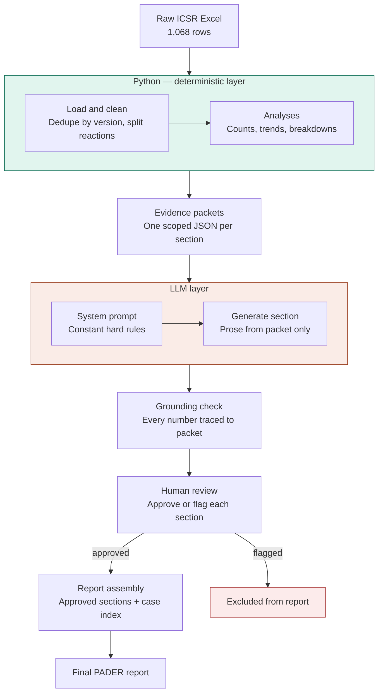

# Architecture Diagram

**Legend:** Teal = deterministic Python (no AI). Coral = LLM-involved steps.
Red = sections that fail the grounding check and are excluded rather than
silently included.

## Flow, in words

1. **Raw ICSR data** (Excel) is loaded and cleaned — cases deduplicated by
   keeping the latest report version per case, comma-joined reaction
   fields split into individual records.
2. **Deterministic analyses** compute every required statistic in plain
   Python/pandas — no LLM involvement at this stage.
3. **Evidence packets** are assembled: one small, scoped JSON per report
   section, containing only the numbers that section needs.
4. **The LLM layer** takes one constant system prompt (defining hard rules
   about grounding and tone) plus one packet per call, and generates prose
   for that section only.
5. **A deterministic grounding check** extracts every number in the
   generated text and verifies it appears in the packet that was sent —
   catching any number the model introduced that wasn't actually provided.
6. **Human review**: every section, alongside its packet and grounding
   check result, is marked approved or flagged. Only approved sections
   proceed.
7. **Report assembly** is pure string templating — no LLM call — arranging
   already-approved text and already-computed tables (including the full
   case index) into the final document.
